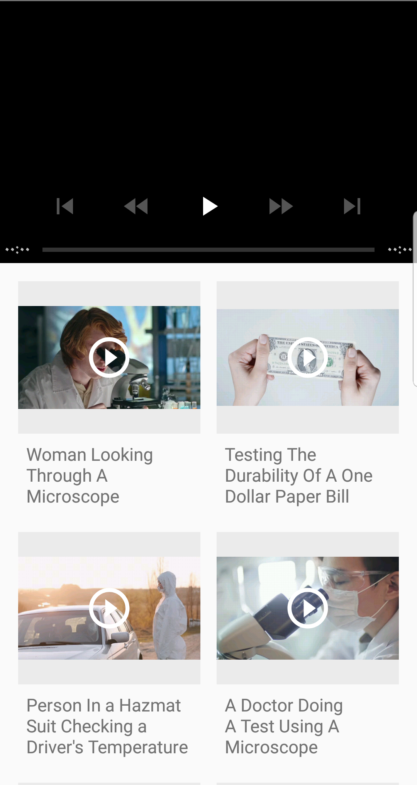
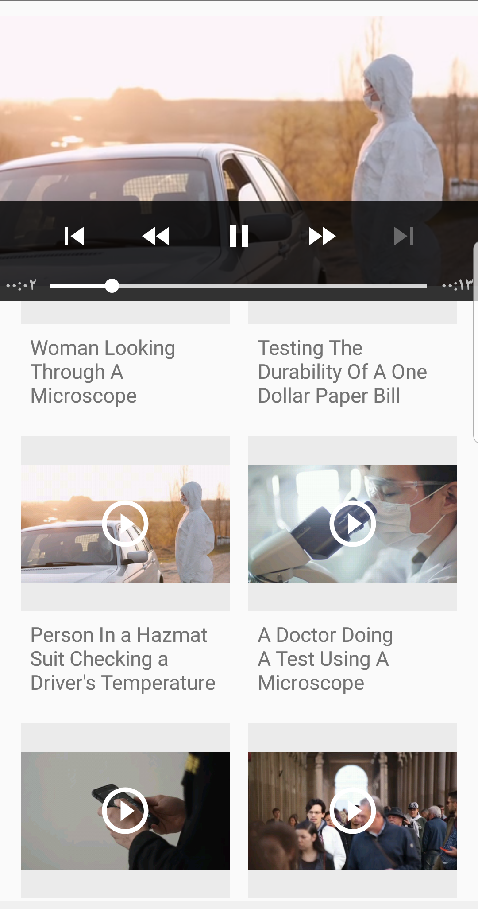

# Video Player

This project is an Android application that showcases a grid of videos. Users can select a video from the grid to play it using ExoPlayer. The application demonstrates the use of RecyclerView, ExoPlayer, and Glide for loading video thumbnails.

This project was developed after completing the course **"Introduction to Android Mobile Application Development"** on Coursera.

## Features

- Display a grid of videos using RecyclerView.
- Play selected videos using ExoPlayer.
- Load video thumbnails using Glide.
- Handle activity lifecycle events to manage the video player.

## Screenshots




## Requirements

- Android Studio
- Minimum SDK version: 21
- Target SDK version: 30

## Setup

1. Clone the repository:
    ```sh
    git clone https://github.com/NassemAlbanna/Video-Player.git
    ```
2. Open the project in Android Studio.
3. Build and run the project on an emulator or a physical device.

## Code Overview

### MainActivity

`MainActivity` sets up the RecyclerView and initializes ExoPlayer. It handles the lifecycle events to manage the player's state.

### GridAdapter

`GridAdapter` is a custom adapter for the RecyclerView that displays the grid items. It uses Glide to load video thumbnails and sets up click listeners for each item.

### GridItem

`GridItem` is a data class representing each item in the grid, containing a title and a video URI.


## Acknowledgements

- [ExoPlayer](https://github.com/google/ExoPlayer) - An extensible media player for Android.
- [Glide](https://github.com/bumptech/glide) - An image loading and caching library for Android.
- The course [Introduction to Android Mobile Application Development](https://www.coursera.org/learn/introduction-to-android-mobile-application-development) on Coursera, which provided the foundation for developing this project.
